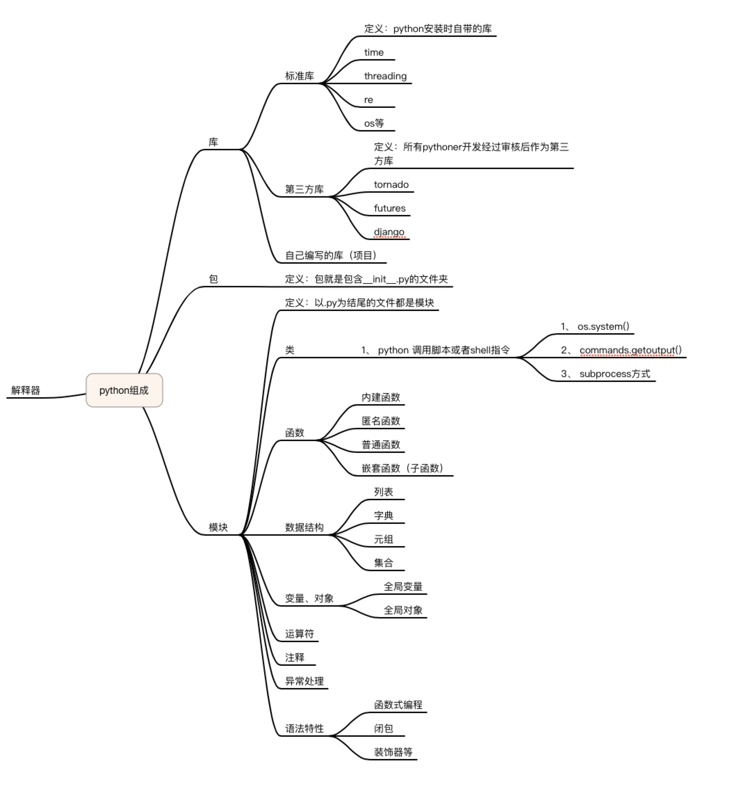

## week 1

### 1.1 库，包，模块
库>=包>=模块

- 库：python的一个一个项目
- 包：库中文件夹中包含__init__.py文件，则文件夹被称为python中的一个包，文件夹中的子文件夹也可以称为子包。没有__init__.py时，import包时将无法识别包
- 模块：以.py文件结尾的文件都是模块

### 1.2 导入
import放在程序前面，按照Python标准模块，Python第三方模块，自定义模块的顺序从上到下排开

```
import os

from ... import ...
```
from a import b: a如果是包，则b是模块， a是模块，则b是函数或类

### 1.3 搜索模块路径

- 程序所在目录
- python安装标准库目录
- 第三方库目录


### 1.4 python组成


### 1.5 python五要素

- 注释：
    
    a. # 个人注释 
    
    b. """""" docstrings包，函数，模块，类的使用说明，包括使用示例和单元测试，推荐对每一个包、模块、类、函数写docstrings. 可以通过函数来获取注释

- 缩进

- 空行
    
    - 模块中类和函数之间空2行（函数之间）
    - 类中的函数（方法）之间空一行
    - 函数中的逻辑段落间加空行，即把相关的代码逻辑写在一起，作为一个逻辑段落，逻辑段落以空行分隔
    - 在import不同种类的模块间加空行

- 命名
类使用驼峰式，其它的都采用小写加下划线。

所有语言中，常量所有字母大写，下划线连接

- import
将所有的import文件加载到当前文件来运行。

    - import顺序： 标准库，第三方库，自己开发的项目中的模块。 这几种用空行分隔开
    - 一条import语句尽量只import一个模块
    - import文件的时候，先找当前目录，其次标准目录，最后第三方库


### 内建函数
```
import time
time.strftime("%Y-%m-%d %H:%M:%S", time.localtime())
'2018-08-01 07:49:30'
```


#### isinstance
type()返回类型

```
isinstance(12, bool)
False
isinstance(True, bool)
True
isinstance('sdfs', str)
```
