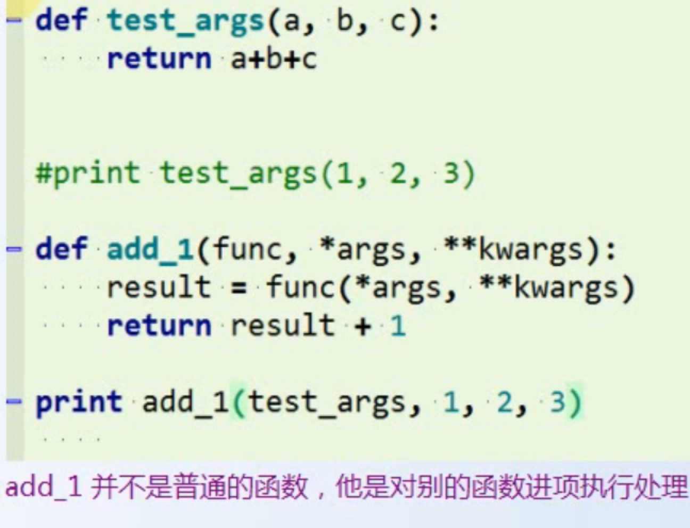

# 函数
```
a = {'LiLei':94, 'lily':80, 'Lucy': 75, 'HanMeimei':90}
```
排序：
```
sorted(a.items(), key=lambda item:item[1], reverse=True)
[('LiLei', 94), ('HanMeimei', 90), ('lily', 80), ('Lucy', 75)]
```
### 函数定义、规范
- 多处调用，不会编辑重复代码
- 好调试
- 更好的梳理支持架构

#### 规范
- 功能单一，抽象解藕
- 单行不要超过80个字符
- 封装一个行数尽量不要超过50行

```
def fun_name(params):
    do something
    return...

```

- 函数名：字母，数字，下划线，不能以数字开头
- 参数：一个或多个或不传，逗号隔开
- 返回值可有可无

### 函数参数
参数: 函数的参数是存在内存中的栈信息，函数执行完后便会释放掉。
- 普通参数

- 默认参数： 函数参数有默认值，不传值时使用默认值
- 变长参数： 参数个数可变，调用函数的时候，可以传入人一个数的参数。
    - *用来传递任意个`无名字`的参数，这些参数会一个tuple的形式访问。
    - \**用来处理传递任意个`有名字`的参数，这些参数用dict来访问。

*args: tuple

**kwargs: 传入key=value是存储的字典

如果函数定义的参数是 *arg, **kwargs的变长参数，那么就是说参数不设限。这类大部分是函数式编程: 参数是别的函数的名字，作用: 对别的函数进行执行和处理。


```
def test(a, *args, **kwargs):
	print(a)
	print(args)
	print(kwargs)

test(1,2,3, t=4,f=5)
1
(2, 3)
{'t': 4, 'f': 5}
```


